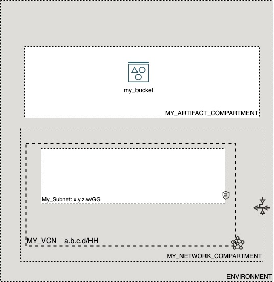

# OCI Cloud Bricks: Object Storage

[](https://img.shields.io/badge/license-UPL-green) [](https://sonarcloud.io/dashboard?id=oracle-devrel_terraform-oci-cloudbricks-object-storage)

## Introduction
The following cloud brick enables you to create object storages in OCI

## Reference Architecture
The following is the reference architecture associated to this brick


### Prerequisites
- Pre-existent Compartment structure

## Sample tfvars file

```shell
########## SAMPLE TFVAR FILE ##########
########## PROVIDER SPECIFIC VARIABLES ##########
region           = "foo-region-1"
tenancy_ocid     = "ocid1.tenancy.oc1..abcdefg"
user_ocid        = "ocid1.user.oc1..aaaaaaabcdefg"
fingerprint      = "fo:oo:ba:ar:ba:ar"
private_key_path = "/absolute/path/to/api/key/your_api_key.pem"
########## PROVIDER SPECIFIC VARIABLES ##########
########## ARTIFACT SPECIFIC VARIABLES ##########
object_storage_instance_compartment_name = "MY_ARTIFACT_COMPARTMENT"
bucket_access_type                       = "NoPublicAccess"
bucket_display_name                      = "my_bucket"
object_events_enabled                    = false
auto_tiering                             = "Disabled"
storage_tier                             = "Standard"
versioning                               = "Enabled"
########## ARTIFACT SPECIFIC VARIABLES ##########
########## SAMPLE TFVAR FILE ##########
```

### Variable specific considerations
- Variable `bucket_access_type` determines the type of access given to bucket. Available options are `NoPublicAccess`
- Variable `object_events_enabled` will trigger CloudEvents API to be enabled for bucket, so that upon any action on top of if, this can emit events to later on be integrated by API, for example with Oracle Functions
- Variable `storage_tier` determines the tier related to the Object Storage. Potential values are `Standard`and `Archive`
- Variable `auto_tiering` will trigger the movement of Object Storage from *Standard* to *Infrecuent Access*. 

## Sample provider
The following is the base provider definition to be used with this module

```shell
terraform {
  required_version = ">= 0.13.5"
}
provider "oci" {
  region       = var.region
  tenancy_ocid = var.tenancy_ocid
  user_ocid        = var.user_ocid
  fingerprint      = var.fingerprint
  private_key_path = var.private_key_path
  disable_auto_retries = "true"
}

provider "oci" {
  alias        = "home"
  region       = data.oci_identity_region_subscriptions.home_region_subscriptions.region_subscriptions[0].region_name
  tenancy_ocid = var.tenancy_ocid  
  user_ocid        = var.user_ocid
  fingerprint      = var.fingerprint
  private_key_path = var.private_key_path
  disable_auto_retries = "true"
}
```
---

## Variable documentation
## Requirements

No requirements.

## Providers

| Name | Version |
|------|---------|
| <a name="provider_oci"></a> [oci](#provider\_oci) | 4.40.0 |

## Modules

No modules.

## Resources

| Name | Type |
|------|------|
| [oci_objectstorage_bucket.Bucket](https://registry.terraform.io/providers/hashicorp/oci/latest/docs/resources/objectstorage_bucket) | resource |
| [oci_identity_compartments.COMPARTMENTS](https://registry.terraform.io/providers/hashicorp/oci/latest/docs/data-sources/identity_compartments) | data source |
| [oci_objectstorage_namespace.NAMESPACE](https://registry.terraform.io/providers/hashicorp/oci/latest/docs/data-sources/objectstorage_namespace) | data source |

## Inputs

| Name | Description | Type | Default | Required |
|------|-------------|------|---------|:--------:|
| <a name="input_auto_tiering"></a> [auto\_tiering](#input\_auto\_tiering) | Determines if autotiering is enabled for object | `string` | `"Enabled"` | no |
| <a name="input_bucket_access_type"></a> [bucket\_access\_type](#input\_bucket\_access\_type) | (Optional) (Updatable) The type of public access enabled on this bucket. A bucket is set to NoPublicAccess by default, which only allows an authenticated caller to access the bucket and its contents. When ObjectRead is enabled on the bucket, public access is allowed for the GetObject, HeadObject, and ListObjects operations. When ObjectReadWithoutList is enabled on the bucket, public access is allowed for the GetObject and HeadObject operations. | `string` | `"NoPublicAccess"` | no |
| <a name="input_bucket_display_name"></a> [bucket\_display\_name](#input\_bucket\_display\_name) | (Required) The name of the bucket. Valid characters are uppercase or lowercase letters, numbers, hyphens, underscores, and periods. Bucket names must be unique within an Object Storage namespace. Avoid entering confidential information. example: Example: my-new-bucket1 | `any` | n/a | yes |
| <a name="input_fingerprint"></a> [fingerprint](#input\_fingerprint) | API Key Fingerprint for user\_ocid derived from public API Key imported in OCI User config | `any` | n/a | yes |
| <a name="input_object_events_enabled"></a> [object\_events\_enabled](#input\_object\_events\_enabled) | Whether or not events are emitted for object state changes in this bucket. By default, objectEventsEnabled is set to false. Set objectEventsEnabled to true to emit events for object state changes. For more information about events, see Overview of Events. | `bool` | `false` | no |
| <a name="input_object_storage_instance_compartment_id"></a> [object\_storage\_instance\_compartment\_id](#input\_object\_storage\_instance\_compartment\_id) | Object storage compartment OCID | `string` | `""` | no |
| <a name="input_object_storage_instance_compartment_name"></a> [object\_storage\_instance\_compartment\_name](#input\_object\_storage\_instance\_compartment\_name) | Object storage compartment name | `string` | `""` | no |
| <a name="input_private_key_path"></a> [private\_key\_path](#input\_private\_key\_path) | Private Key Absolute path location where terraform is executed | `any` | n/a | yes |
| <a name="input_region"></a> [region](#input\_region) | Target region where artifacts are going to be created | `any` | n/a | yes |
| <a name="input_storage_tier"></a> [storage\_tier](#input\_storage\_tier) | The storage tier type assigned to the bucket. A bucket is set to 'Standard' tier by default, which means objects uploaded or copied to the bucket will be in the standard storage tier. When the 'Archive' tier type is set explicitly for a bucket, objects uploaded or copied to the bucket will be stored in archive storage. The 'storageTier' property is immutable after bucket is created. | `string` | `"Standard"` | no |
| <a name="input_tenancy_ocid"></a> [tenancy\_ocid](#input\_tenancy\_ocid) | OCID of tenancy | `any` | n/a | yes |
| <a name="input_user_ocid"></a> [user\_ocid](#input\_user\_ocid) | User OCID in tenancy. | `any` | n/a | yes |
| <a name="input_versioning"></a> [versioning](#input\_versioning) | The versioning status on the bucket. A bucket is created with versioning Disabled by default. For versioning Enabled, objects are protected from overwrites and deletes, by maintaining their version history. When versioning is Suspended, the previous versions will still remain but new versions will no longer be created when overwitten or deleted. | `string` | `"Enabled"` | no |

## Outputs

| Name | Description |
|------|-------------|
| <a name="output_bucket"></a> [bucket](#output\_bucket) | Bucket Object |
## Contributing
This project is open source.  Please submit your contributions by forking this repository and submitting a pull request!  Oracle appreciates any contributions that are made by the open source community.

## License
Copyright (c) 2021 Oracle and/or its affiliates.

Licensed under the Universal Permissive License (UPL), Version 1.0.

See [LICENSE](LICENSE) for more details.
